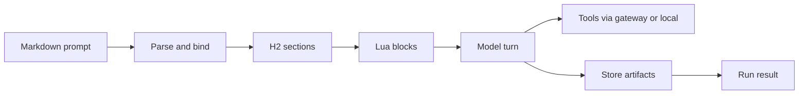

[](https://github.com/cppalliance/promptforge/actions/workflows/ci.yml)
[](https://crates.io/crates/promptforge-cli)
[](LICENSE)
[](https://www.rust-lang.org/)

# PromptForge

A runtime that executes AI prompt pipelines defined in a single markdown file. The markdown is the program, the model is the CPU. YAML frontmatter for metadata, embedded Lua for logic, prose blocks for model instructions, and a credential-holding gateway that keeps vendor keys off the prompt process. Write a prompt, run it, get a result.


## What you get

- 📄 **Markdown prompts** - frontmatter, one H1, H2 sections that run top to bottom
- 🔧 **Lua control** - bind tools and models, compute values, write the store, fan out work, chunk markdown with `md_to_json`
- 🌐 **Tools that ship** - local `web_fetch`, gateway-backed `web_search`, semantic capability binding
- 🔌 **Inference gateway** - OpenAI-shaped chat, bearer auth, catalog at `GET /v1/models`
- 🛰️ **MCP server** - run prompts from an agentic harness over streamable HTTP or stdio


## Quick example

````markdown
---
name: greet
description: Greet the named input using a Lua-computed value
promptforge: 1
---

# Greet

```lua
models.default("writer", "A model suited for careful analysis, coding, and general assistance")
```

## Main

```lua
var.greeting = "Hello, " .. args .. "!"
```

Repeat exactly, with no extra words: {{ var.greeting }}
````

Prose goes to the model. Lua sets up the turn. The response is the run's result.


## Quick start

```bash
cargo install promptforge-cli promptforge-gateway
promptforge-gateway serve gateway.toml --profile main &
promptforge run prompts/hello.md
```

Building from source:

```bash
git clone git@github.com:cppalliance/promptforge.git
cd promptforge
cargo build
```

The first build downloads the tool picker's embedding model (~130MB from Hugging Face, pinned and checksummed). Later builds reuse the cache.

Two processes: the gateway holds the vendor credential; the client points at it.

```bash
export ANTHROPIC_API_KEY=sk-ant-...
export PROMPTFORGE_GATEWAY_API_KEY=dev-secret
cargo run -p promptforge-gateway -- serve gateway.toml --profile main &

export PROMPTFORGE_GATEWAY_URL=http://127.0.0.1:8081/v1
cargo run -p promptforge-cli -- run prompts/hello.md
```

Add `--verbose` (`-v`) to `run` to print the run's lifecycle to stderr as it happens: section boundaries, model turns, tool calls, and any `log()` checkpoints from the prompt's Lua. The gateway logs each chat completion request and response (model, message and tool counts, finish reason, elapsed time) at `RUST_LOG=info`.

Interactive prompt work against an already-running gateway:

```bash
cargo run -p promptforge-dev -- prompts/greet.md "world" --watch
```


## How it works

Parse a promptforge markdown file, bind the tools and models it needs, then execute each H2 section in order. Section Lua prepares state; prose becomes a model turn (with a tool loop when tools are in scope); results land in the store or become the run output.




## Crates

| Crate | Description | crates.io |
| --- | --- | --- |
| [promptforge-core](crates/promptforge-core) | Parser, executor, Lua runtime, store, gateway client | [](https://crates.io/crates/promptforge-core) |
| [promptforge-cli](crates/promptforge-cli) | `promptforge run` command-line binary | [](https://crates.io/crates/promptforge-cli) |
| [promptforge-gateway](crates/promptforge-gateway) | Inference gateway with model catalog and credential isolation | [](https://crates.io/crates/promptforge-gateway) |
| [promptforge-mcp-server](crates/promptforge-mcp-server) | MCP server for agentic harnesses (Cursor, Claude Code) | [](https://crates.io/crates/promptforge-mcp-server) |
| [promptforge-tool-picker](crates/promptforge-tool-picker) | Semantic tool resolution via sentence embeddings | [](https://crates.io/crates/promptforge-tool-picker) |
| [promptforge-webfetch](crates/promptforge-webfetch) | SSRF-safe web fetch tool for model-supplied URLs | [](https://crates.io/crates/promptforge-webfetch) |
| [promptforge-dev](crates/promptforge-dev) | Interactive prompt development with watch mode | [](https://crates.io/crates/promptforge-dev) |
| [promptforge-ws-server](crates/promptforge-ws-server) | Workshop HTTP server: chat relay, session tape, voice transcription | not published |
| [promptforge-ws](crates/promptforge-ws) | Workshop desktop window shell (wry/tao) | not published |

## Documentation

- [PromptForge User Guide](https://cppalliance.github.io/promptforge/) - full documentation
- [User Guide](guide/promptforge-user-guide.md) - progressive tutorial for writing prompts
- [design-core.md](design/design-core.md) - core design notes


## Minimum Rust Version

Rust 1.89 or later.

## Contributing

Build, format, and test before you open a PR. CI runs `cargo fmt --check`, `clippy -D warnings`, and `cargo test --workspace`.


## License

Distributed under the [Boost Software License 1.0](LICENSE).
